MProtoNet: A Case\-Based Interpretable Model for Brain Tumor Classification with 3D Multi\-parametric Magnetic Resonance Imaging

[pdf](https://arxiv.org/abs/2304.06258)

[code](https://github.com/aywi/mprotonet)

MIDL 2023 Oral paper

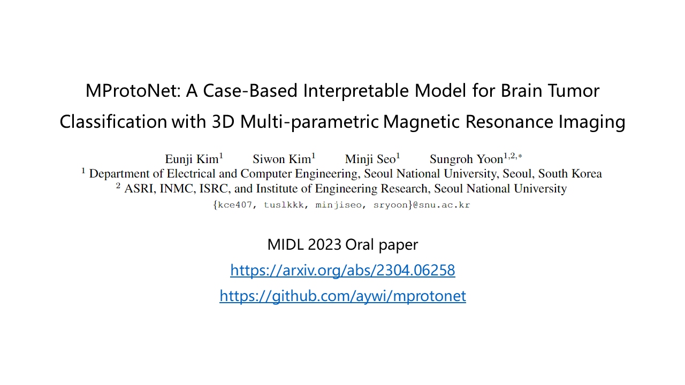
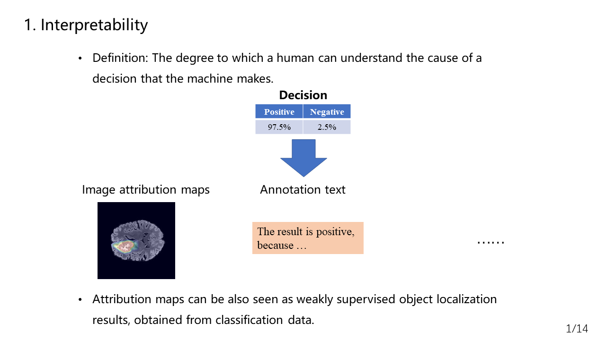
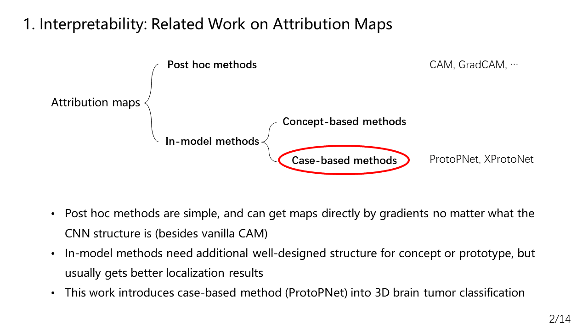
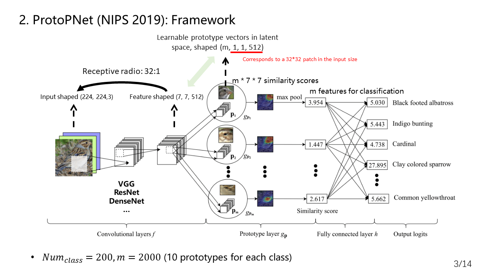
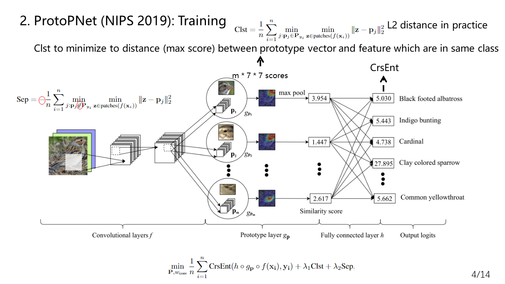
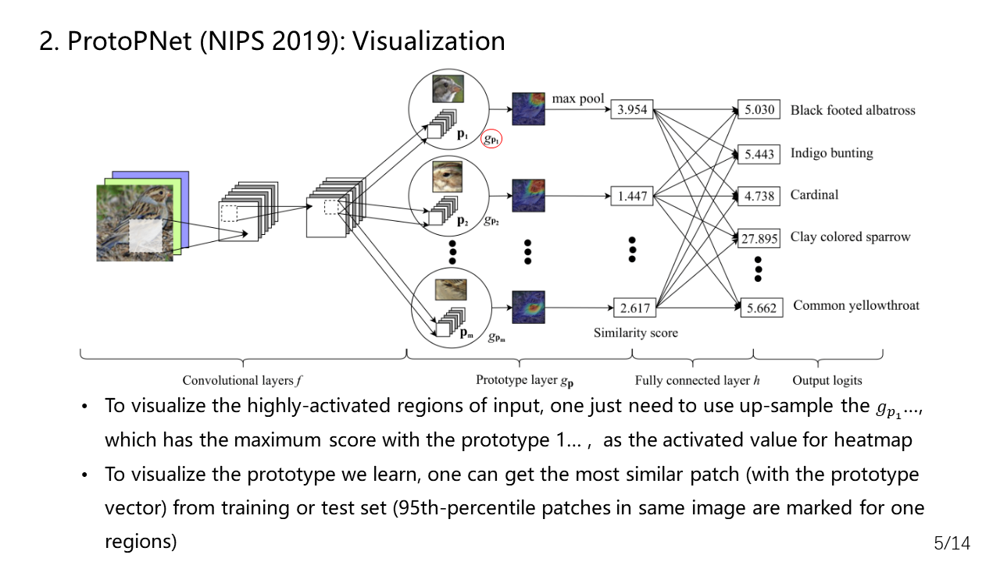
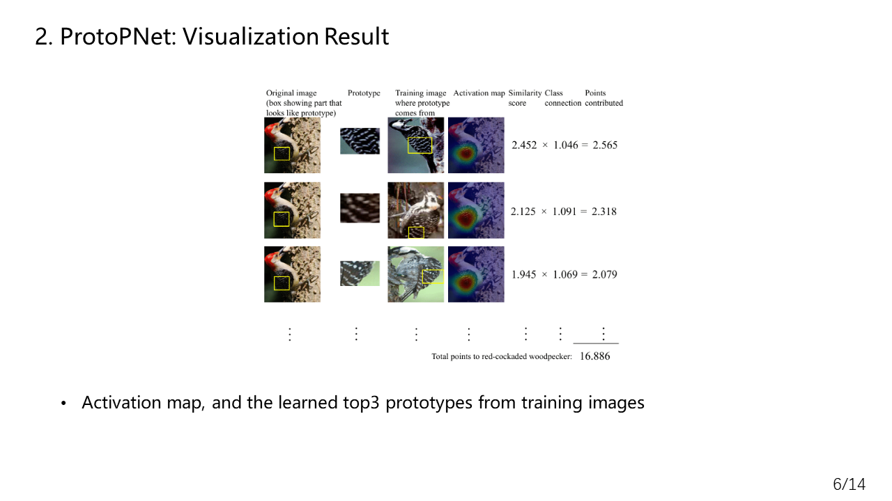
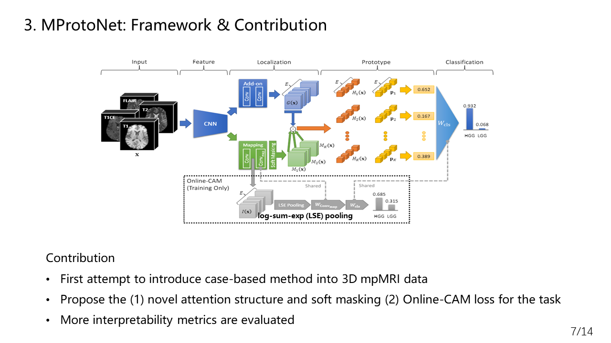

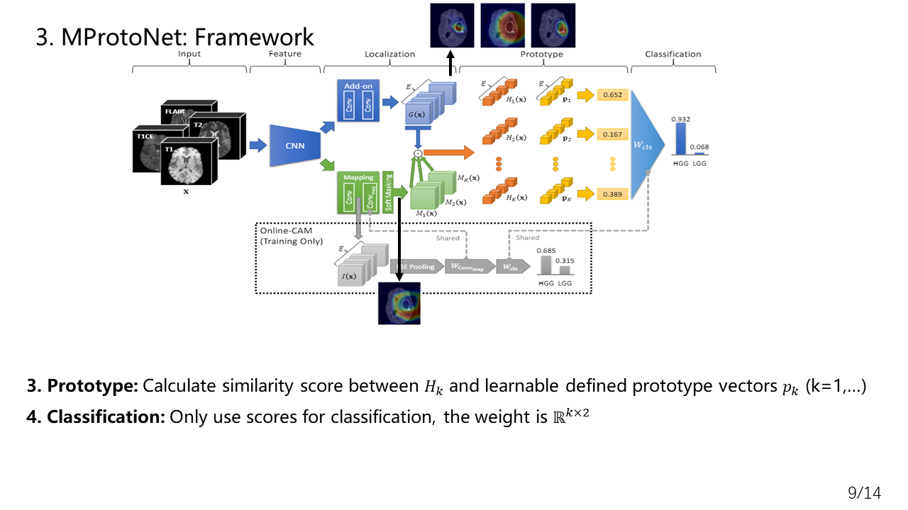
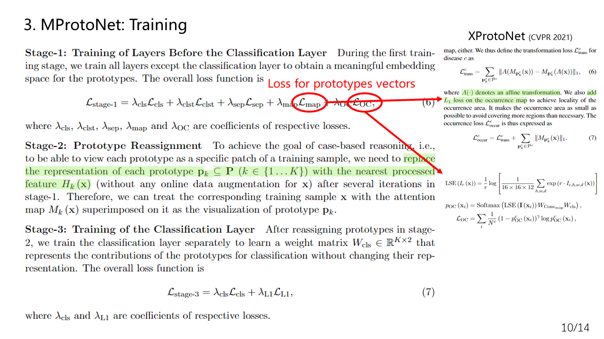
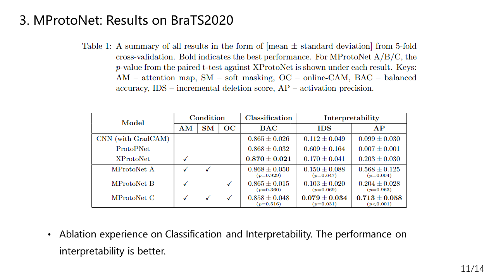
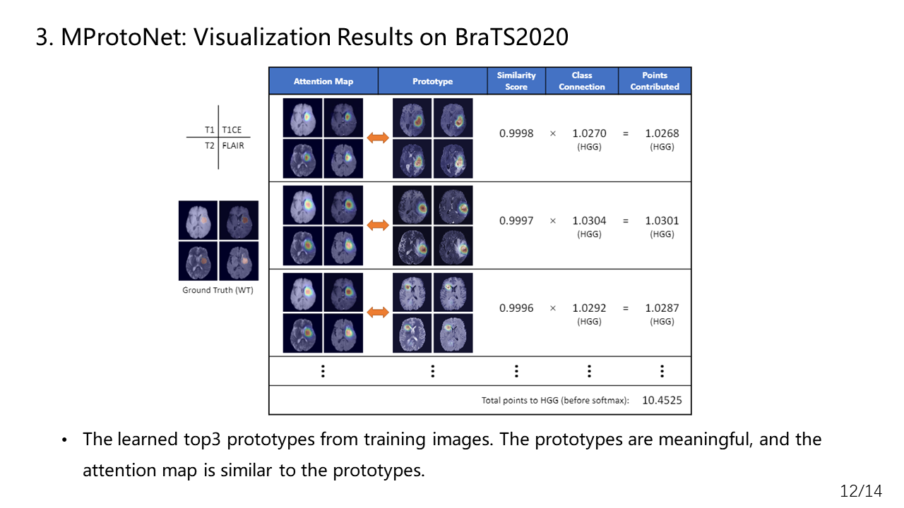
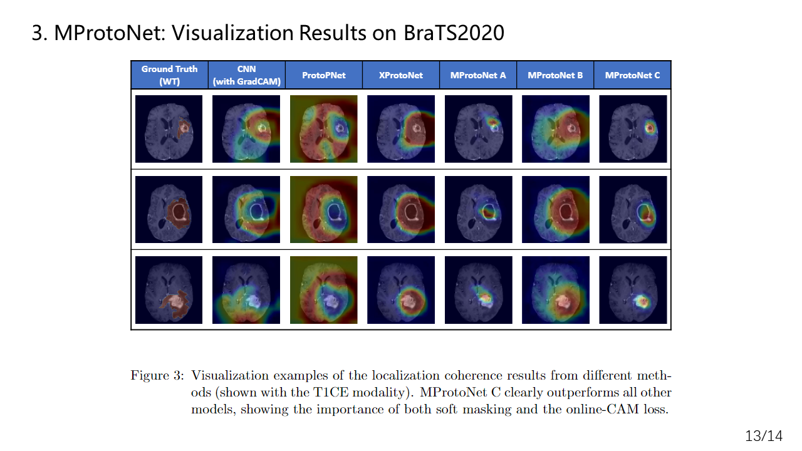
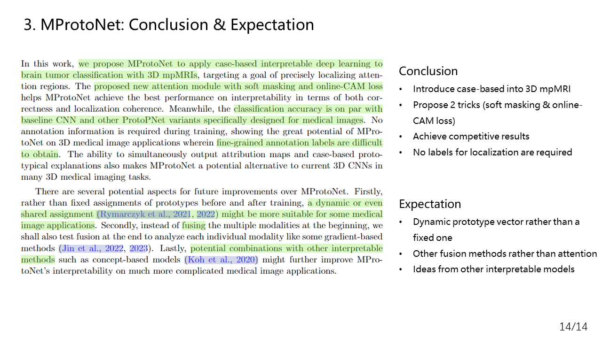

